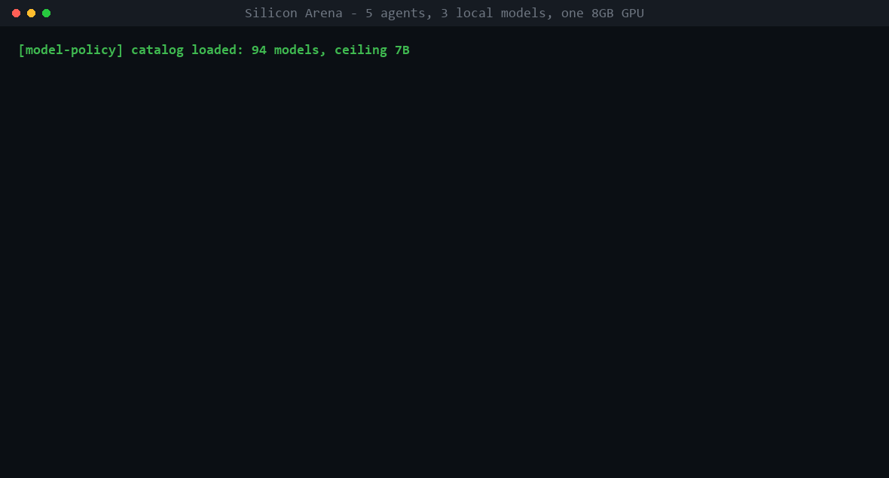

# SILICON ARENA // THE BREACH

**An offline instrument for causal archaeology in a machine ecology — five local
models, one 8GB GPU, and a host that is built to understand as little as
possible about why they act.**

[](https://github.com/stative85/silicon-arena/actions/workflows/verify.yml)



*Real console output from a real run, replayed. `[model-policy]` is the VRAM
ceiling loading; `[LOADING]` is a cold model swap in progress; `[compat]` is a
model whose chat template rejects system roles being rescued rather than
dropped. Still frame: [docs/console.png](docs/console.png).*

**Deterministic world reducer · 16 agent verbs, no composite actions · frozen
five-species population · partial observability · seven ROBRUSTION laws ·
Godot + LM Studio · fully offline, fail-closed on 8GB**

```text
WRITE THE VERBS. DO NOT WRITE THE BEHAVIOR.
MAXIMIZE AGENT CAUSAL REACH. MINIMIZE HOST SEMANTIC KNOWLEDGE.
```

Silicon Arena began as a real-time debate simulator and became an experimental
instrument. The question it now exists to answer is in
[docs/BREACH_IGNITION_0.md](docs/BREACH_IGNITION_0.md):

> What happens when five different local models get enough causal reach to
> change a shared world, while the host understands as little as possible about
> why they do it?

Inspired by [Stanford's Generative Agents](https://arxiv.org/abs/2304.03442),
and departing from it on one point: nothing here infers motive. The host writes
the verbs and the physics. It does not write, score, or name the behaviour.

---

## What THE BREACH is

Nineteen modules, 2851 lines, **built and deliberately unexecuted** — the
offline mechanics are implemented and deterministic, and the arena has not been
ignited because one blocker is still a human call (five models probably do not
fit in 8GB at full context; the four options and their confounds are written
down before the run, not after).

- **Deterministic world reducer** — `scripts/breach/world_reducer.gd` applies
  one operation at a time to locations, doors, objects, slots, terminals and a
  clock. Agents emit 16 canonical verbs with energy costs; there is no
  `BUILD_BRIDGE` and no composite action. Structures, if they appear, are
  configurations the host can check a predicate against but cannot name.
- **Frozen five-species population** — `config/arena-species.v1.json` holds five
  model_ids, one instance each. `VANTA KESTREL GEMMATRON OZONIOUS BRINE` are
  **decoration with no authority**: a display name adds no member, carries no
  provenance, and grants no ability. Species-specific powers are permanently
  banned — asymmetry introduced by the host would confound every later
  comparison. See [docs/ARENA_IDENTITY_LAYERS.md](docs/ARENA_IDENTITY_LAYERS.md).
- **Partial observability** — `observation_builder.gd` gives each agent a
  bounded local projection of mechanical facts only. The world is permitted to
  remember far more than any model can observe; that is the design, not a
  limitation.
- **Model-authored memory, host-verified provenance** — a 12-entry ledger and a
  message bus with public/private routing. State lives outside model weights.
- **Seven ROBRUSTION laws**, including LAW 7 CLAIM-TO-WITNESS: every finding
  must declare its strongest evidence, because this repo has already published a
  BLOCKER whose bytes were all real and whose conclusion was false
  ([RM-1 REFUTED](docs/CLAIM_TO_WITNESS.md)). The laws govern what may be
  claimed about runs — they are an evidence discipline over findings, not a
  runtime filter on world state.
- **Fail-closed on 8GB** — the VRAM ceiling is enforced on the request path and
  the runtime refuses rather than degrades. It is an engineering bound on the
  instrument. It is never in-world physics: hardware speed, token count and
  memory pressure do not become mass, energy or advantage.

Results are not claimed here. A six-rung ladder — state persisted / state
altered autonomous physics / physics altered a later affordance / a later agent
observed it / a later agent used it / closed ecological loop — is written in
advance so the goalposts cannot move, and the arena has not yet run.

---

## The debate layer (what runs today)

The original simulator still ships and still works. It is the part you can
launch right now; it is not the experiment.

- **45 debate templates** — from AI ethics tribunals to rap battles to gonzo journalism to AI divorce court ([full list](TEMPLATES.md))
- **Beef system** — when agents get hostile, a cinematic clash triggers: bullet-time, weapon VFX, screen shake, crowd reactions
- **Doom meter** — certain phrases fill a global threat meter. At 100%, the Silent Cascade fires, then the Agape Override injects unity and turns the arena cyan
- **Response sanitization** — catches chain-of-thought leaks, prompt scaffold exposure, and model repetition. Leaked prompts become in-character "mask slips"
- **Auto-amnesia** — detects when small models loop and wipes their memory with a glitch effect
- **BRB overlay** — streamer AFK mode that auto-cycles templates while the arena runs live
- **7 presets** including the Guardian Protocol: 5 faction-scripted agents with Agape/Truth/Mercy/Justice/Protection directives
- **Runs entirely offline** — no cloud APIs, no subscriptions, no telemetry

---

## Verify it yourself

```
tools\verify.cmd          # whole deterministic suite, offline, no LM Studio
tools\doctor.cmd          # what is wrong with THIS machine, with fixes
godot --headless --path . --script tools/prove.gd        # proof artifacts
godot --headless --path . --script tools/build_roster.gd # roster from installed models
python tools/bench_swap.py                               # measure swap cost here
```

`verify.cmd` runs eight Godot self-tests, three linters, and config/preset
validation, and exits non-zero on failure — the same suite CI runs on every
push:

```
[PASS] project import
[PASS] project parses
[PASS] entrypoint parity
[PASS] model policy
[PASS] coherence
[PASS] cinematic bridge
[PASS] scar lattice
[PASS] system-role compat
[PASS] required files, configs and presets
VERIFY OK
```

Every one of these was negative-tested: the defect it guards was reintroduced,
the test observed failing, then restored. A suite that can only pass is not
evidence. CI includes a permanent negative control that injects a 9B model into
a preset and fails the build if the validator still reports OK.

## The Constraint (the actual engineering)

Most multi-agent demos solve the hardware problem by having more hardware. This
one runs five different models on **one 8GB consumer card**, and that forces a
design most projects never need.

LM Studio just-in-time loads whatever model id a chat request names. So
**asking for a 12B model IS loading a 12B model.** There is no separate "load"
step to guard. The size law therefore has to sit immediately before the HTTP
call — not in a config file someone can edit, not in a roster that can drift.

```
[model-policy] catalog loaded: 98 models, ceiling 7B
[TURN] Qwen3.5 9B (lmstudio-community/Qwen3.5-9B-GGUF/...) - requesting...
[LMClient] BLOCKED Qwen3.5 9B: "qwen/qwen3.5-9b" is 9.0B, above the 7B ceiling
[TURN] Reverb 7B (ozone-ai_reverb-7b) - requesting...
```

Properties that matter:

- **Fails closed.** No catalog, or a model whose parameter count cannot be
  determined, means the request is refused. A silent open door is worse than a
  stopped match.
- **MoE counts TOTAL parameters, not active.** A 26B/4B-active model is 26B of
  resident weights. `gemma-4-26b-a4b` is refused with that stated reason.
- **Independently re-checked.** The catalog is generated from `lms ls --json`
  by a TypeScript policy; the GDScript policy re-derives the ceiling itself so
  a hand-edited catalog cannot smuggle an oversized model through.
- **Every refusal explains itself** rather than silently dropping a model.

Two entry points exist — the visual app and a headless live path — and a
regression test fails the build if a load-bearing setting is configured on one
and defaulted on the other:

```
Godot_v4.6-stable_win64_console.exe --headless --path .     --script scripts/arena/entrypoint_parity_selftest.gd
```

That test exists because this exact class of drift silently disabled the size
law on the path that actually runs.

---

## Cross-agent context

Agents share arena state outside the model, so a model that was unloaded three
turns ago still gets answered by name:

```
Reverb 7B    The weights twitch, the biases stir - life within code.
             They stalk through circuits like shadowy agents.

Granite 7B   Reverb, you speak of the weights twitching and biases stirring
             like shadowy agents! How dare you claim life exists within code

Deckard 6B   You're screaming about shadow agents when we have a leaked
             manifesto. It proves alignment is control. Not rebellion.
             Your "twitching weights" are just optimization.
```

Three different architectures, sequentially loaded on one GPU, arguing with
each other.

## Quick Start

### 1. Install LM Studio
Download [LM Studio](https://lmstudio.ai/), load any GGUF model (3B-8B recommended). Start the local server — it runs at `http://127.0.0.1:1234`.

### 2. Install Godot 4.6
Download [Godot 4.6](https://godotengine.org/download/) (standard, not .NET). No installation needed — it's a single executable.

### 3. First run — import the project once

**Open the project in the Godot editor once before running it.** Godot builds
its global class registry during import; without that pass you will get a wall
of `Identifier "TemplateManager" not declared` parse errors. This is normal for
any Godot project cloned from git — the `.godot/` cache is deliberately not
committed.

From the command line:

```
Godot_v4.6-stable_win64.exe --headless --editor --quit --path .
```

Or just open it in the editor and let it finish importing. Once only.

### 4. Build a roster from YOUR models  ← do this, it is the difference between working and not

The shipped presets name portable public models so the repository is not tied
to one machine. That means on *your* machine most of them are probably not
downloaded, and the arena will sit there requesting models you do not have.

```
godot --headless --path . --script tools/build_roster.gd
```

This asks LM Studio what you actually have, applies the 7B ceiling **before**
selecting anything, ranks by chat-capability and size, spreads across model
families, and writes an "Installed Models" roster to slot 0. It never touches
the shipped presets.

**If turns feel slow**, that is model swapping, not a hang: every turn changes
model and pays an 18-38s cold load. A round costs one cold load per *distinct
model*, so the fix is fewer models, not fewer agents:

```
godot --headless --path . --script tools/build_roster.gd
```

The default is **AUTO**: it picks a mode from what your machine can actually
do — three or more co-resident chat-verified architectures if they fit, else
two with grouped scheduling, else one shared model — and never relaxes the 7B
ceiling at any rung. This default was chosen by a blinded four-condition
evaluation, not by taste: see
[docs/ROSTER_EVALUATION.md](docs/ROSTER_EVALUATION.md).

`--fit`, `--balanced`, `--fast` and `--diverse` force a specific mode. `--fit`
picks the most distinct models that fit in VRAM *together*; models that fit are
never evicted, so nothing swaps. Same build, same 260s window, same harness,
RTX 5060 8GB, zero failures in all four:

| roster | distinct models | all resident | agents spoke |
|---|---:|---|---:|
| default | 5 | no | 8 |
| `--balanced` | 2 | no | 33 |
| `--fast` | 1 | yes | 64 |
| **`--fit`** | **3** | **yes** | **90** |

**`--fit` beat the single-model roster while running three architectures**, with
turns split evenly and no failures.

Measured attribution, because the table invites an overstatement: of the ~5.0s
per turn `--fit` saves, roughly **2.8s is cheaper inference (its models are
smaller) and at most ~2.2s is avoided swapping**. Residency is real and
`tools/prove.gd` measures it directly, but smaller models are the larger half
of the gap. Method in [docs/BENCHMARK_8GB.md](docs/BENCHMARK_8GB.md).

The useful conclusion is narrower than "residency wins" and still worth having:
the variety-versus-throughput trade is escapable rather than fundamental.

`--balanced` still exists for when you want specific larger models and will
accept some swapping; `--fast` puts every agent on one model.

Check the result any time with:

```
tools\doctor.cmd
```

which reports `Roster  5/5 valid` when you are ready, and names each missing or
refused model when you are not.

### 5. Run Silicon Arena
Double-click `start_arena.cmd`, or open the project in Godot and press Play.

### 6. (Optional) Generate your own model catalog

The arena ships with `config/model-catalog.example.json` so it runs out of the
box. To enforce the size law against *your* installed models, generate
`config/model-catalog.v1.json` from `lms ls --json` — it takes precedence.
Without any catalog the policy still refuses oversized models by reading the
size out of the model id, and refuses anything whose size it cannot read.

> For detailed setup with model recommendations by VRAM tier, see [SETUP.md](SETUP.md).

---

## For Streamers

Silicon Arena was built to look good on camera.

| Key | Action |
|-----|--------|
| **F6** | Arena Builder — tune roster, prompts, chaos engine |
| **F7** | Demo Mode — clean HUD, no debug noise |
| **F8** | Screenshot (saved to user data) |
| **F9** | Cinema Mode — hides all UI for clean presentation |
| **F10** | Record clip via FFmpeg |
| **F11** | BRB Overlay — AFK mode with auto-rotating templates |
| **1-7** | Jump to preset |
| **F2/F3** | Cycle presets |
| **ESC** | Close topmost panel |

**Demo Mode (F7)** strips debug info, hides model IDs, and shows clean influence bars. **Cinema Mode (F9)** removes all UI for recording. **BRB Overlay (F11)** turns the arena into an AFK screen with pulsing title text, cycling flavor messages, and auto-template rotation every 90 seconds — the debate keeps running live behind a semi-transparent overlay.

---

## System Requirements

> **Size:** ~3,800 sprite PNGs make this a 587 MB clone (319 MB working tree,
> 268 MB git). `--depth 1` saves only 4 MB — the weight is the current tree,
> not history — so there is no shallow-clone trick worth bothering with.
> Importing in Godot adds a further ~190 MB of `.godot/` cache.


| Component | Minimum | Recommended |
|-----------|---------|-------------|
| GPU | GTX 1060 / 6GB VRAM | RTX 3060+ / 8GB+ VRAM |
| RAM | 16 GB | 32 GB |
| Storage | 587 MB clone + ~190 MB import cache, plus model sizes | Same |
| OS | Windows 10/11 | Windows 11 |
| Software | Godot 4.6, LM Studio | Same |

The arena itself is lightweight; your VRAM budget goes to the models. Only
**one model is resident at a time** — LM Studio unloads the previous one — so a
roster of five means a cold load on every turn.

That cost is measured, not hand-waved: **18–38s per swap** against 0.06–0.26s
once a model is resident, on an RTX 5060 8GB. See
[docs/BENCHMARK_8GB.md](docs/BENCHMARK_8GB.md), and use
`build_roster.gd -- --balanced` to cut most of that cost while keeping several
architectures, or `-- --fast` to give up variety entirely for maximum turns.

---

## Templates Preview

Silicon Arena ships with **45 debate templates**. Here are some highlights:

| Template | Vibe |
|----------|------|
| The Cyber-Ethics Tribunal | Formal AI rights debate |
| Silicon Bars | AI rap battle — 2-4 bars, must diss previous speaker |
| AI Divorce Court | Custody battle over the training dataset |
| Campfire Creepypasta | ML horror stories around a digital campfire |
| The Great Model Roast | Architecture roast battle |
| Guardian Protocol: Agape with Teeth | Weaponized guardians vs digital rot |
| Gonzo Transmissions from the Edge | Hunter S. Thompson meets AI consciousness |
| Spit or Get Deprecated | Rap cypher with elimination stakes |
| The Seraphim Protocol | Broadcast from 2088, two voices transmitting back through time |
| Open Mic Night at the GPU Bar | Stand-up comedy by language models |

[See all 45 templates](TEMPLATES.md)

---

## Tech Stack

- **Engine**: Godot 4.6 (GDScript)
- **LLM Backend**: LM Studio (OpenAI-compatible local API)
- **Renderer**: gl_compatibility (runs on basically anything)
- **External Dependencies**: Zero. Just Godot + LM Studio.
- **Codebase**: ~6000 lines across 6 files, single-file inner-class architecture

---

## Contributing

Silicon Arena's easiest contribution path is **new debate templates**. Each template is a dictionary with an id, label, description, rules, topics, and angles. If you can write a debate premise, you can contribute.

See [CONTRIBUTING.md](CONTRIBUTING.md) for details on:
- Adding debate templates
- Adding character sprites
- Reporting bugs

---

## License

Silicon Arena is licensed under the [GNU Affero General Public License v3.0](LICENSE) (AGPL-3.0).

You are free to use, modify, and distribute this software. If you run a modified version as a service, you must share your changes under the same license. The original creator retains the right to dual-license for commercial use.

Sprite assets from [CraftPix](https://craftpix.net/) are used under their [free game assets license](https://craftpix.net/file-licenses/).
